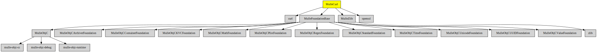

# MulleCurl

#### 🥌 HTTP client library for mulle-objc

Uses [libcurl](https://curl.haxx.se) to GET and POST `NSData` from URLs.
It uses the **easy** interface of libcurl. The curl library is compiled
for HTTP(S) only.

Written in and for [mulle-objc](//mulle-objc.github.io).

> #### Note
>
> On linux ensure, that openssl is available:
> `sudo apt-get install libssl-dev` (debian/ubuntu)
>


| Release Version                                       | Release Notes  | AI Documentation
|-------------------------------------------------------|----------------|---------------
|  [](//github.com/MulleWeb/MulleCurl/actions) | [RELEASENOTES](RELEASENOTES.md) | [DeepWiki for MulleCurl](https://deepwiki.com/MulleWeb/MulleCurl)


## Usage


This example fetches a text file and prints it out.

``` objc
#import <MulleCurl/MulleCurl.h>

#include <stdio.h>

static NSString   *URL = @"https://www.mulle-kybernetik.com/weblog/2019/mulle_objc_0_16_release.html";


int  main( void)
{
   MulleCurl   *curl;
   NSData      *data;
   NSError     *error;

   curl = [[MulleCurl new] autorelease];
   [curl setOptions:@{
                       @"CURLOPT_SSL_VERIFYPEER": @(NO),
                       @"CURLOPT_SSL_VERIFYHOST": @(NO)
                     }];
   data = [curl dataWithContentsOfURLWithString:URL];
   if( ! data)
   {
      error = [NSError mulleExtractError];
      fprintf( stderr, "%s\n", [[error description] UTF8String]);
      return( 1);
   }

   printf( "%.*s", (int) [data length], [data bytes]);
   return( 0);
}
```

Notable is the simple interface. Instead of `-dataWithContentsOfURL:error:` it
is just `-dataWithContentsOfURLWithString:`. You don't have to wrap the string
into an NSURL and the NSError can be retrieved later if desired.

[MulleWeb](//github.com/MulleWeb/MulleWebClient) adds a `NSURL` interface for
convenience.


### You are here




## Add

Use [mulle-sde](//github.com/mulle-sde) to add MulleCurl to your project:

``` sh
mulle-sde add github:MulleWeb/MulleCurl
```

## Install

### Install with mulle-sde

Use [mulle-sde](//github.com/mulle-sde) to build and install MulleCurl and all dependencies:

``` sh
mulle-sde install --prefix /usr/local \
   https://github.com//MulleCurl/archive/latest.tar.gz
```

### Manual Installation

Install the requirements:

| Requirements                                 | Description
|----------------------------------------------|-----------------------
| [openssl](https://github.com/openssl/openssl)             | 
| [curl](https://curl.haxx.se/curl/tree/)             | 
| [MulleFoundationBase](https://github.com/MulleFoundation/MulleFoundationBase)             | 🧱 MulleFoundationBase amalgamates Foundations projects
| [MulleZlib](https://github.com/MulleWeb/MulleZlib)             | 🐘 Zlib compression for mulle-objc
| [mulle-objc-list](https://github.com/mulle-objc/mulle-objc-list)             | 📒 Lists mulle-objc runtime information contained in executables.

Download the latest [tar](https://github.com/MulleWeb/MulleCurl/archive/refs/tags/latest.tar.gz) or [zip](https://github.com/MulleWeb/MulleCurl/archive/refs/tags/latest.zip) archive and unpack it.

Install **MulleCurl** into `/usr/local` with [cmake](https://cmake.org):

``` sh
PREFIX_DIR="/usr/local"
cmake -B build                               \
      -DMULLE_SDK_PATH="${PREFIX_DIR}"       \
      -DCMAKE_INSTALL_PREFIX="${PREFIX_DIR}" \
      -DCMAKE_PREFIX_PATH="${PREFIX_DIR}"    \
       -DCMAKE_BUILD_TYPE=Release &&
cmake --build build --config Release &&
cmake --install build --config Release
```

### Platforms and Compilers

All platforms and compilers supported by
[mulle-c11](//github.com/mulle-c/mulle-c11).


## Author

[Nat!](https://mulle-kybernetik.com/weblog) for Mulle kybernetiK  

